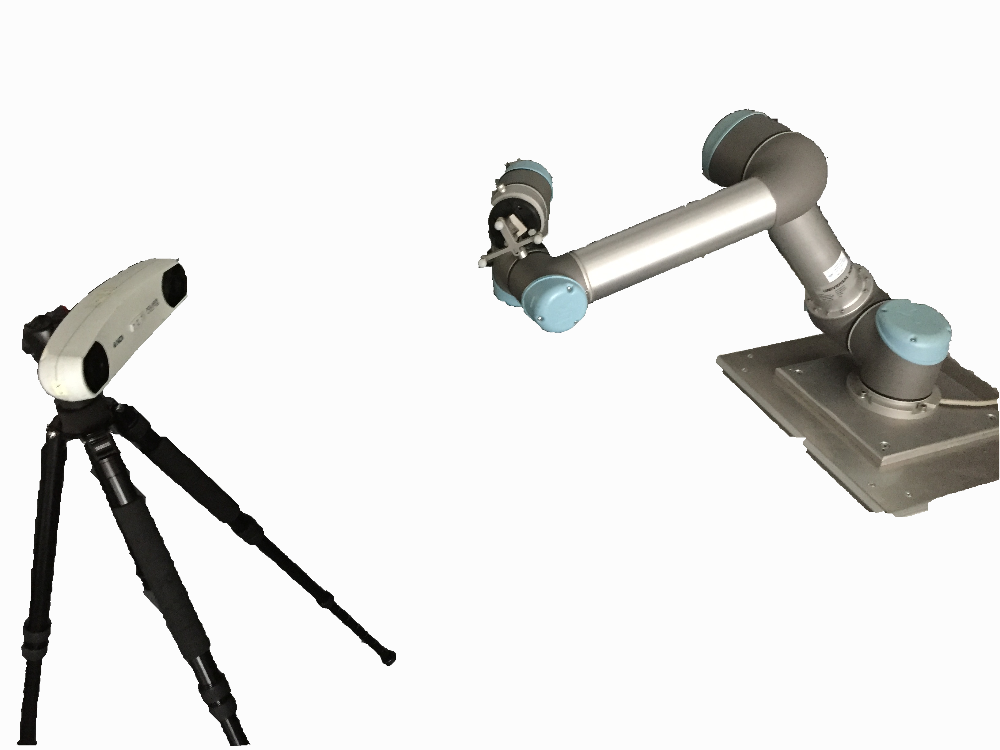
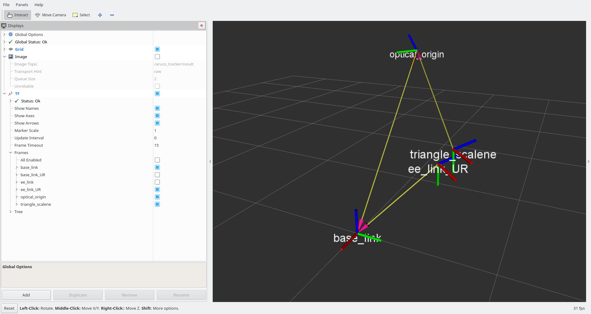
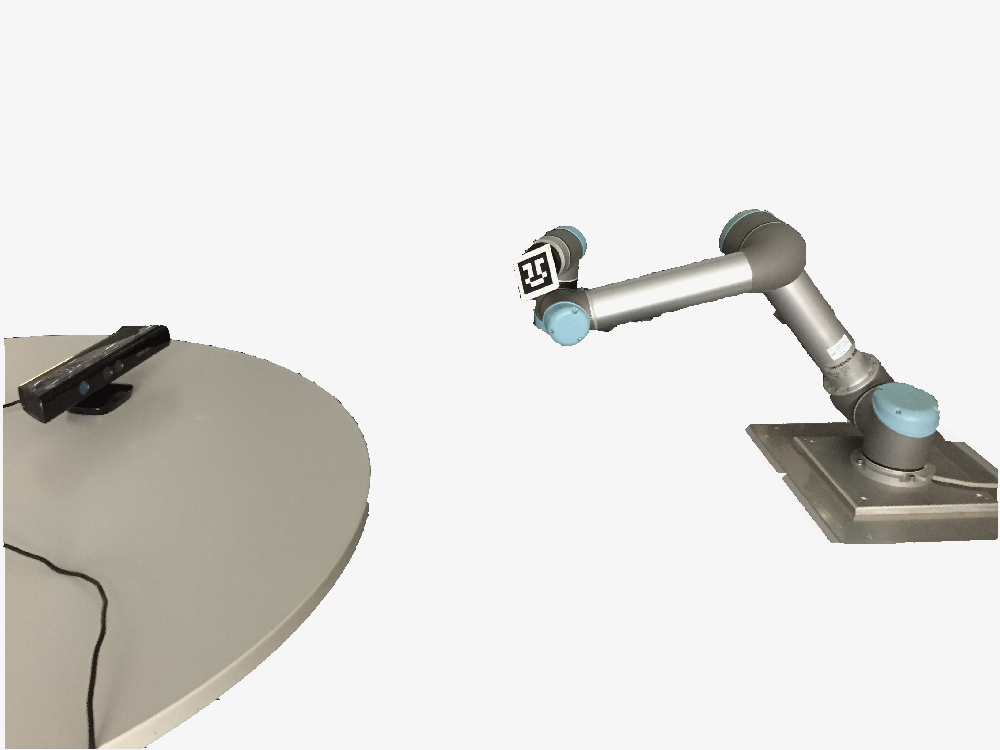
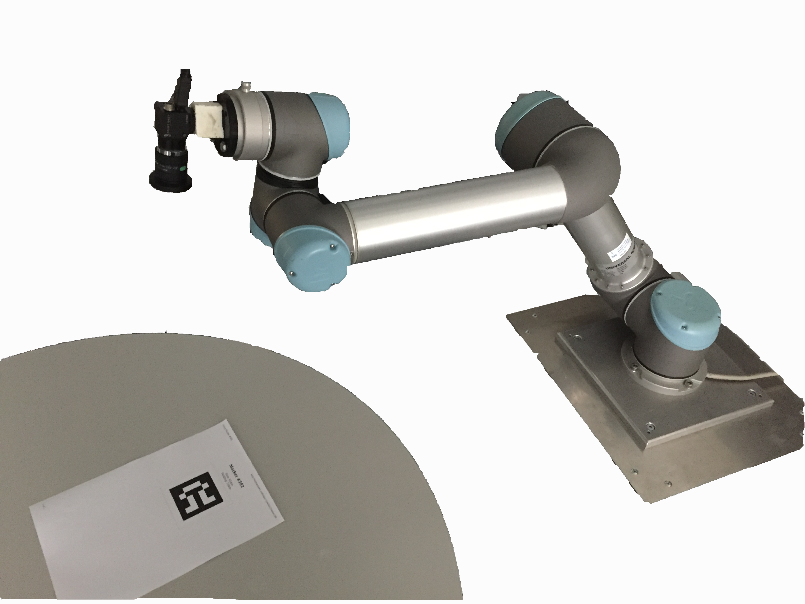

easy_handeye: TF / VISP Hand-Eye Calibration
============================================

  

This package wraps the hand-eye calibration routine from the ViSP library
(contained in the `visp_hand2eye_calibration` package) to provide a simple
camera pose estimation solution. Input is expected as transformations published in TF.

Additionally, a method for saving and publishing the resulting calibration is provided.
Computing and using a calibration can be achieved by including/starting a single launch file respectively.

An (optional) GUI for the position sampling and automatic robot movement is provided in the `rqt_easy_handeye` package.

## Use Cases

If you are unfamiliar with Tsai's hand-eye calibration [1], it can be used in two ways:

- **eye-in-hand** -- To compute the static transform between the reference frames of
  a robot's hand effector and that of a tracking system, e.g. the optical frame
  of an RGB camera used to track AR markers. In this case, the camera is
  mounted on the end-effector, and you place the visual target so that it is
  fixed relative to the base of the robot; for example, you can place an AR marker on a table.
- **eye-on-base** -- To compute the static transform from a robot's base to a tracking system, e.g. the
  optical frame of a camera standing on a tripod next to the robot. In this case you can attach a marker,
  e.g. an AR marker, to the end-effector of the robot.
  
A relevant example of an eye-on-base calibration is finding the position of an RGBD camera with respect to a robot for object collision avoidance, e.g. [with MoveIt!](http://docs.ros.org/indigo/api/moveit_tutorials/html/doc/pr2_tutorials/planning/src/doc/perception_configuration.html): an [example launch file](docs/example_launch/ur5_kinect_calibration.launch) is provided to perform this common task between an Universal Robot and a Kinect through aruco. eye-on-hand can be used for [vision-guided tasks](https://youtu.be/nBTflbxYGkI?t=24s).

The (arguably) best part is, that you do not have to care about the placement of the auxiliary marker
(the one on the table in the eye-in-hand case, or on the robot in the eye-on-base case). The algorithm
will "erase" that transformation out, and only return the transformation you are interested in.


eye-on-base             |  eye-on-hand
:-------------------------:|:-------------------------:
  |  

## Usage

Two launch files, one for computing and one for publishing the calibration respectively,
are provided to be included in your own. The default arguments should be
overridden to specify the correct tf reference frames, and to avoid conflicts when using
multiple calibrations at once.

### Calibration

For both use cases, you can either launch the `calibrate.launch`
launch file, or you can include it in another launchfile as shown below. Either
way, the launch file will bring up the `visp_hand2eye_calibration` solver, along with an
integration script. By default, the integration script will interactively ask you
to accept or discard each sample. At the end, the parameters will be saved in a yaml file.

#### eye-in-hand

```xml
<launch>
  <include file="$(find easy_handeye)/launch/calibrate.launch">
    <arg name="eye_on_hand" value="true"/>

    <arg name="robot_base_frame" value="/base_link"/>
    <arg name="robot_effector_frame" value="/ee_link"/>

    <arg name="tracking_base_frame" value="/optical_origin"/>
    <arg name="tracking_marker_frame" value="/optical_target"/>
  </include>
</launch>
```

#### eye-on-base

```xml
<launch>
  <include file="$(find easy_handeye)/launch/calibrate.launch">
    <arg name="eye_on_hand" value="false"/>

    <arg name="robot_base_frame" value="/base_link"/>
    <arg name="robot_effector_frame" value="/ee_link"/>

    <arg name="tracking_base_frame" value="/optical_origin"/>
    <arg name="tracking_marker_frame" value="/optical_target"/>
  </include>
</launch>
```


### Moving the robot

A GUI for automatic robot movement is provided by the `rqt_easy_handeye` package. Please refer to [its documentation](rqt_easy_handeye/README.md).


 

### Tips for accuracy

The following tips are given in [1], paragraph 1.3.2.

- Maximize rotation between poses.
- Minimize the distance from the target to the camera of the tracking system.
- Minimize the translation between poses.
- Use redundant poses.
- Calibrate the camera intrinsics if necessary / applicable.
- Calibrate the robot if necessary / applicable.

### Publishing
The `publish.launch` starts a node that publishes the transformation found during calibration in tf.
The parameters are automatically loaded from the yaml file.

### FAQ
How can I ...
##### Calibrate an RGBD camera (e.g. Kinect, Xtion, ...) with a robot for automatic object collision avoidance with MoveIt! ?
This is a perfect example of an eye-on-base calibration. You can take a look at this [example launch file](docs/example_launch/ur5_kinect_calibration.launch) written for an UR5 and a Kinect via aruco_ros.
##### Disable the automatic robotic movements GUI?
You can pass the argument `freehand_robot_movement:=true` to `calibrate.launch`.
##### Calibrate one robot against multiple tracking systems?
You can just override the `namespace` argument of `calibrate.launch` to be always different, such that they will never collide. Using the same `namespace` as argument to multiple inclusions of `publish.launch` will allow you to publish each calibration in tf.
##### Find the transformation between the bases of two robots?
You could perform the eye-on-base calibration against the same tracking system, and concatenate the results.
##### Find the transformation between two tracking systems?
You could perform the eye-on-base calibration against the same robot, and concatenate the results. This will work also if the tracking systems are completely different and do not use the same markers.

## References

[1] *Tsai, Roger Y., and Reimar K. Lenz. "A new technique for fully autonomous
and efficient 3D robotics hand/eye calibration." Robotics and Automation, IEEE
Transactions on 5.3 (1989): 345-358.*
