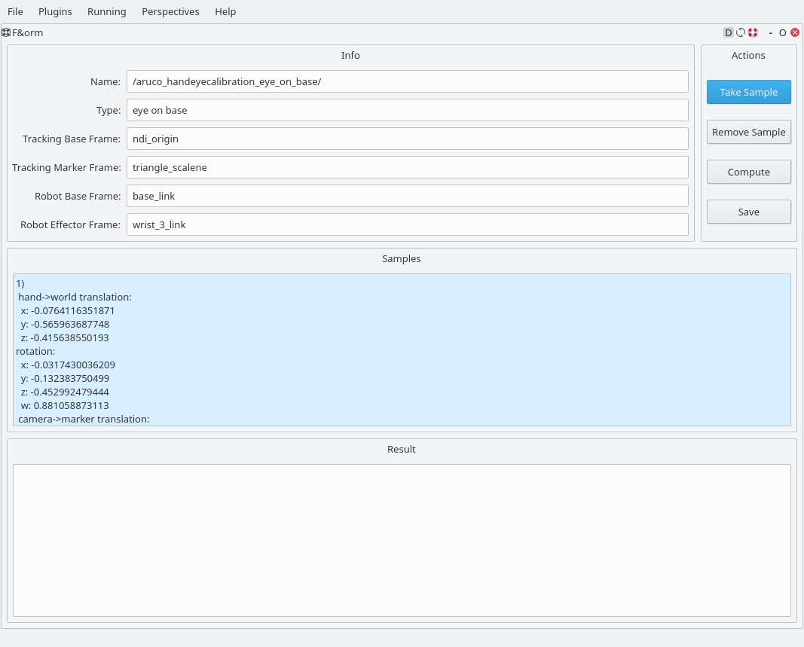
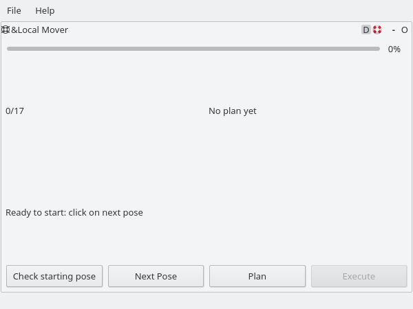
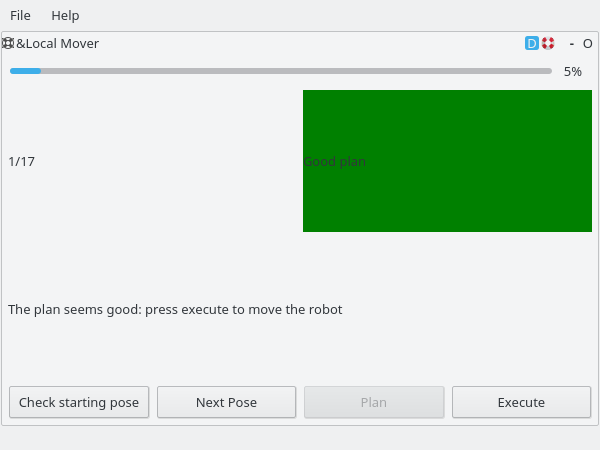
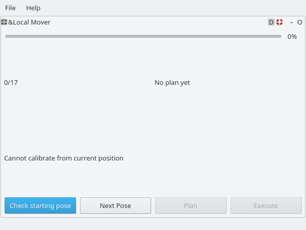
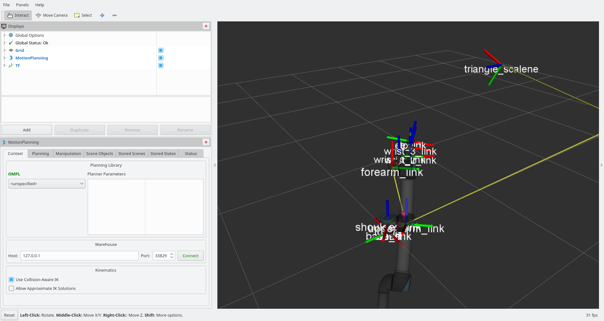
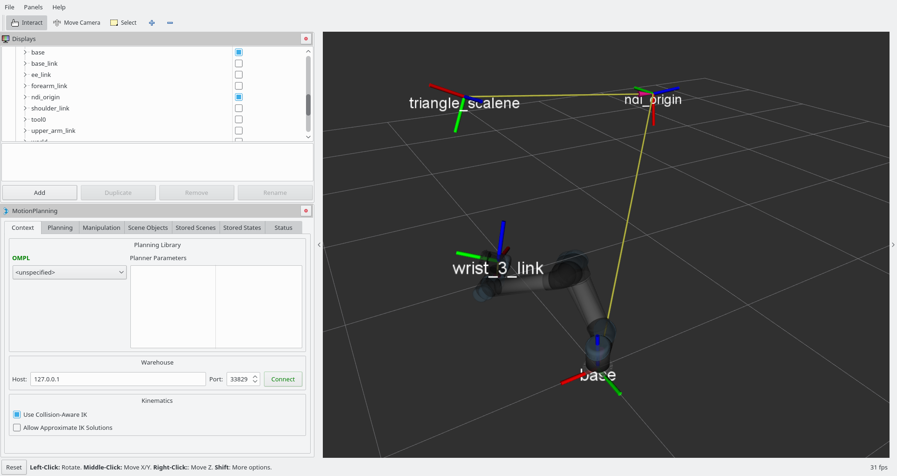

rqt_easy_handeye: GUI for easy_handeye
============================================

This package includes a comprehensive GUI for performing and managing Hand-Eye calibrations in a simple manner.

This includes:
- a graphical interface to command the calibrator script included in `easy_handeye`
- a GUI for moving the robot around its starting position with MoveIt! [1]

 

The calibrator interface allows you to:
- sample the robot and tracking system transforms
- review all samples
- remove a sample
- compute the calibration from the current samples
- save the calibration to file

The automatic robot movements interface guides you through the calibration process. 
  

First, it allows you to check that it is possible to rotate the robot end effector about all axes, and translate it in all directions (you can pass the rotation and translation ranges as a parameter). It avoids interrupting the calibration process in the middle because the robot cannot move in a certain direction due to joint limits or collisions.

  

Then the wizard allows you to plan the motion: you can review the trajectory in RViz, if the motion planning plugin is activated (and correctly configured, which should be the case by default). If the movement is not "crazy", that is if the joints of the robot stay within a certain range from the initial position, you can make MoveIt! execute the motion plan; otherwise you can skip the point. The joint range is also configurable as a parameter.

 

Once the robot has completed the motion, you can take a sample and proceed to the next pose; the robot will go back to the initial position first.

## References

[1]  [MoveIt!](http://http://moveit.ros.org/) motion planning software
